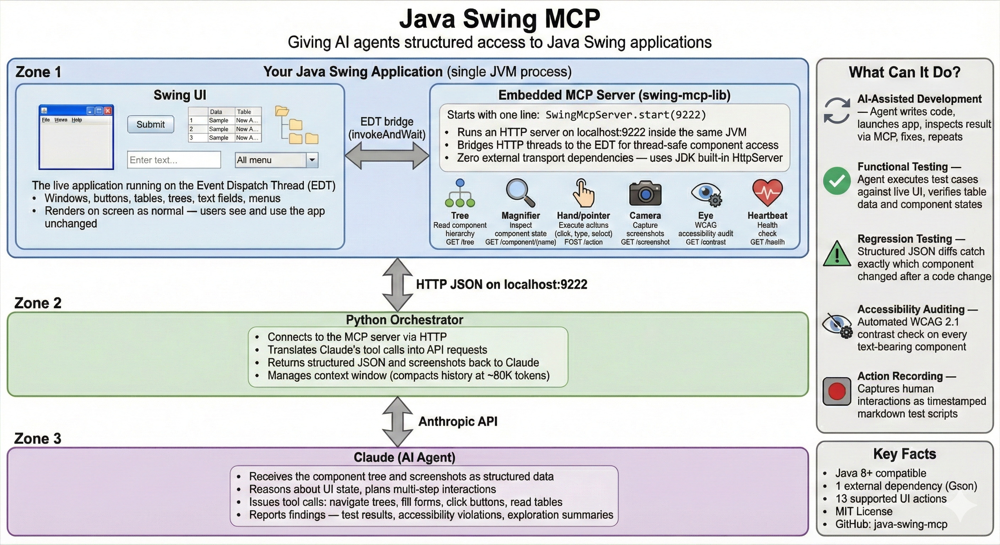

# Java Swing MCP Server

Giving AI agents structured access to Java Swing applications - and a portable pattern for any fat client.

## Why This Exists

JavaScript developers have it figured out. Their AI agents launch a browser, open DevTools, inspect the DOM, click elements, read state, fix code, and repeat - all programmatically. The entire write-test-fix loop runs autonomously because the browser exposes everything through structured APIs (Chrome DevTools Protocol, DOM inspection, element selectors).

Desktop fat client applications have none of this. Java Swing, WPF, Qt, GTK, Win32/MFC, Delphi - these applications are black boxes. No DOM. No DevTools. No structured inspection. The only option for an AI agent is pixel-based screen scraping - screenshots, mouse coordinates, OCR - which is fragile, slow, and lossy.

This matters because fat clients still power critical enterprise systems in trading, healthcare, logistics, and government. Their state lives in memory, not in a database. Their behavior is event-driven and non-linear. Their most important behaviors are often emergent - the result of dozens of independent listeners, timers, and handlers interacting in ways that nobody fully designed and nobody currently on the team fully understands. The running application is its own documentation, and that documentation is inaccessible to any tool that cannot observe the UI programmatically.

These applications are locked out of the agentic AI development loop - the loop where an AI agent writes code, launches the app, inspects the result, identifies issues, fixes the code, and repeats until it works. They are also locked out of AI-assisted legacy rewrite efforts, where the first and hardest step is understanding what the old application actually does.

**Java Swing MCP Server fixes this for Swing, and demonstrates a pattern that applies to any fat client framework.** It's a lightweight Java library that embeds an HTTP server directly inside any Swing application. One line of code - `SwingMcpServer.start(9222)` - and the entire UI becomes accessible as structured JSON data. AI agents get the same powers over Swing apps that browser DevTools give over web apps: read the component tree, inspect state, execute actions by name, capture screenshots, and audit accessibility.

The port number 9222 is intentional - it's the same default port used by Chrome DevTools Protocol.

## Demos

Demo videos are available on the [Java Swing MCP YouTube channel](https://www.youtube.com/@java-swing-mcp).

## Architecture Overview



The system has three components:

**1. swing-mcp-lib (inside the JVM)** - A reusable Java library that embeds an HTTP server inside the Swing application's own JVM process. It shares direct access to the live component hierarchy on the Event Dispatch Thread (EDT). Not a Java agent - no bytecode instrumentation, no JVM flags. Six internal engines handle component tree traversal, state extraction, action execution, screenshot capture, WCAG contrast checking, and user action recording.

**2. Python Orchestrator (outside the JVM)** - A Claude agent loop that connects to the embedded server via HTTP on localhost:9222. Translates Claude's tool calls into API requests, returns structured JSON and screenshots, and manages context window compaction at ~80K tokens.

**3. Claude AI Agent** - Receives the component tree and screenshots as structured data. Reasons about UI state, plans multi-step interactions, issues tool calls, and produces reports. Any AI model or HTTP client can fill this role - Claude is not required.

## What Can It Do?

**AI-Assisted Development** - The agent writes code, launches the app, inspects the result through the MCP server, identifies issues, fixes the code, relaunches, and repeats. This is the Swing equivalent of a JavaScript developer's hot-reload + browser DevTools loop, driven by AI.

**Legacy Application Rewrite Support** - Rewrite teams can observe the actual running application instead of relying on stale wikis and incomplete user interviews. An AI agent can methodically explore the application screen by screen, workflow by workflow, and produce structured documentation of what exists. The action recorder captures real user behavior over time, revealing which features are used daily, which are never used, and what the actual sequence of actions looks like for common workflows. This closes the observation gap that causes most rewrite projects to fail.

**Functional Testing** - Define test cases as natural language prompts. The agent navigates the UI, fills forms, submits actions, and verifies results by reading actual component state - not pixels.

**Regression Testing** - After a code change, the agent compares structured component trees and states against baselines. It knows exactly which component changed, what property changed, and by how much - no fuzzy pixel diffs.

**Accessibility Auditing** - Automated WCAG 2.1 contrast ratio checking on every text-bearing component. Returns exact colors, ratios, and AA/AAA pass/fail per component.

**Action Recording** - Captures human interactions (mouse clicks, key presses, combo selections, tree navigation) as timestamped markdown files that serve as reproducible test scripts or user behavior analysis data.

**Business Analyst Enablement** - BAs can explore the application programmatically through the HTTP API or through an AI assistant connected to it. What are all the columns in this table? What values appear in this dropdown? What changes in the UI when I switch the order type? These questions become HTTP requests that return structured, accurate, current answers.

## About the Demo Trading App

The included equity trading application exists solely to demonstrate how the MCP server works. It is a generic representation of a trading application UI - it is not connected to, derived from, or based on any real system at any workplace. The app is intentionally left unfinished, with known bugs and missing features, so that others can use it as a practice project for fixing issues and implementing new functionality with the help of AI agents and the MCP server.

## Prerequisites

- **Java 8+** (tested on Java 1.8.0_202; newer versions work too)
- **Python 3.10+** (for the orchestrator)
- **Anthropic API key** set as `ANTHROPIC_API_KEY` environment variable

No global Gradle installation needed - the project includes a Gradle Wrapper.

## Quick Start

```bash
# 1. Build the Java project
cd java-swing-mcp
./gradlew build              # Unix/macOS
gradlew.bat build            # Windows

# 2. Run the demo app (opens UI + starts MCP server on :9222)
./gradlew :demo-app:run      # Unix/macOS
gradlew.bat :demo-app:run    # Windows

# 3. In another terminal, verify the server is running
curl http://localhost:9222/health
# {"status":"ok","components":85,"uptime":5}

# 4. Run the orchestrator to have Claude interact with the app
cd orchestrator
pip install -r requirements.txt
python orchestrator.py "Explore the app, submit a test order, check for contrast issues"
```

## HTTP API Reference

All endpoints return `Content-Type: application/json`. All Swing component access is performed on the EDT via `SwingUtilities.invokeAndWait()`.

### `GET /tree` - Component Tree

Returns the component tree as a flat JSON array with parent references.

**Query parameters:**

| Parameter | Type | Default | Description |
|-----------|------|---------|-------------|
| `interactable` | boolean | `true` | If true, return only interactive components (buttons, fields, combos, tables, trees, menus) |
| `types` | string | all | Comma-separated filter, e.g. `JButton,JTextField` |
| `depth` | integer | unlimited | Maximum traversal depth |

**Example:**
```bash
# Get all interactive components (default)
curl "http://localhost:9222/tree"

# Get everything including layout containers
curl "http://localhost:9222/tree?interactable=false"

# Get only buttons and text fields
curl "http://localhost:9222/tree?types=JButton,JTextField"
```

**Response:**
```json
[
  {
    "id": 1,
    "type": "JFrame",
    "name": "mainFrame",
    "parent": null,
    "bounds": {"x": 0, "y": 0, "width": 1200, "height": 800},
    "screenBounds": {"x": 100, "y": 100, "width": 1200, "height": 800},
    "visible": true,
    "enabled": true,
    "focused": false,
    "text": "Equity Trading",
    "accessibleRole": "FRAME",
    "childCount": 4
  },
  {
    "id": 5,
    "type": "JButton",
    "name": "placeOrderButton",
    "parent": 1,
    "text": "Place Order",
    ...
  }
]
```

The tree is serialized as a **flat array** - not nested JSON. Each node carries its own `parent` ID reference. This format is optimized for LLM consumption: compact, easy to reference by ID, and doesn't waste context window tokens on deep indentation.

If the tree exceeds 200 components, the response is wrapped:
```json
{
  "components": [...],
  "truncated": true,
  "totalComponents": 342
}
```

### `GET /component/{nameOrId}` - Component State

Returns detailed state for a single component. Look up by name (string) or ID (numeric).

**Query parameters:**

| Parameter | Type | Default | Description |
|-----------|------|---------|-------------|
| `rows` | string | `0-49` | Row range for JTable data, e.g. `0-9` |

**Examples:**
```bash
# By name
curl http://localhost:9222/component/blotterTable

# By ID
curl http://localhost:9222/component/12

# With row pagination
curl "http://localhost:9222/component/blotterTable?rows=0-4"
```

**JTable response:**
```json
{
  "id": 12,
  "type": "JTable",
  "name": "blotterTable",
  "rowCount": 15,
  "columnCount": 11,
  "columns": ["Time", "Status", "Side", "Qty", "Symbol", "Order Type", "Limit Price", "TIF", "Route", "Account", "Value"],
  "selectedRows": [],
  "data": [
    ["09:30:01", "Executed", "BUY", "100", "AAPL", "MARKET", "", "DAY", "SMART", "ACCT1", "18550.00"],
    ["09:30:05", "Executed", "SELL", "200", "MSFT", "LIMIT", "420.10", "GTC", "NYSE", "ACCT2", "84020.00"]
  ],
  "dataRange": [0, 14],
  "totalRows": 15,
  "hasMore": false,
  "foreground": "#333333",
  "background": "#FFFFFF"
}
```

**JTree response:**
```json
{
  "id": 15,
  "type": "JTree",
  "name": "instrumentTree",
  "selectedPath": "root > Technology > AAPL",
  "expandedPaths": ["root", "root > Technology"],
  "nodes": [
    {"path": "root", "leaf": false, "children": 5},
    {"path": "root > Technology", "leaf": false, "children": 8},
    {"path": "root > Technology > AAPL - Apple Inc", "leaf": true, "children": 0}
  ]
}
```

**JComboBox response:**
```json
{
  "id": 8,
  "type": "JComboBox",
  "name": "orderSideCombo",
  "items": ["BUY", "SELL", "SHORT"],
  "selectedItem": "BUY",
  "selectedIndex": 0,
  "editable": false
}
```

### `POST /action` - Execute Interaction

Execute an action on a component. All actions run on the EDT and return the updated component state after a 100ms settle delay.

**Supported actions:**

| Action | Required Fields | Description |
|--------|----------------|-------------|
| `click` | `target` | `doClick()` for buttons; Robot click for others |
| `double_click` | `target` | Robot double-click at component center |
| `right_click` | `target` | Robot right-click at component center |
| `type` | `target`, `text` | `setText()` for text components; Robot keys for others |
| `clear` | `target` | `setText("")` for text components |
| `select_combo` | `target`, `value` or `index` | Select combo box item by value or index |
| `select_row` | `target`, `row` | Select table row by index |
| `select_tree` | `target`, `path` | Select tree node by path (e.g. `"root > Technology > AAPL"`) |
| `expand_tree` | `target`, `path` | Expand tree node |
| `collapse_tree` | `target`, `path` | Collapse tree node |
| `check` | `target` | Check a checkbox (no-op if already checked) |
| `uncheck` | `target` | Uncheck a checkbox (no-op if already unchecked) |
| `menu` | `path` | Click menu item (e.g. `"File > Save Layout"`) |

**Examples:**
```bash
# Click a button
curl -X POST http://localhost:9222/action \
  -H "Content-Type: application/json" \
  -d '{"action":"click","target":"placeOrderButton"}'

# Type into a text field
curl -X POST http://localhost:9222/action \
  -H "Content-Type: application/json" \
  -d '{"action":"type","target":"symbolField","text":"TSLA"}'

# Select combo box item
curl -X POST http://localhost:9222/action \
  -H "Content-Type: application/json" \
  -d '{"action":"select_combo","target":"orderSideCombo","value":"SELL"}'

# Select tree node
curl -X POST http://localhost:9222/action \
  -H "Content-Type: application/json" \
  -d '{"action":"select_tree","target":"instrumentTree","path":"root > Technology > AAPL"}'

# Click a menu item
curl -X POST http://localhost:9222/action \
  -H "Content-Type: application/json" \
  -d '{"action":"menu","path":"File > Save Layout"}'

# Double-click a table row to open an order ticket
curl -X POST http://localhost:9222/action \
  -H "Content-Type: application/json" \
  -d '{"action":"double_click","target":"quoteTable_Technology","row":0}'
```

**Success response:**
```json
{
  "success": true,
  "action": "click",
  "target": "placeOrderButton",
  "componentState": { ... },
  "error": null
}
```

**Failure response (HTTP 400):**
```json
{
  "success": false,
  "action": "click",
  "target": "nonExistentButton",
  "componentState": null,
  "error": "Component not found: nonExistentButton"
}
```

### `GET /screenshot` - Capture Screenshot

Capture the application window or a specific component as PNG.

**Query parameters:**

| Parameter | Type | Default | Description |
|-----------|------|---------|-------------|
| `component` | string | entire window | Component name or ID to capture |
| `format` | string | `base64` | `base64` for JSON-wrapped, `raw` for PNG bytes |

**Examples:**
```bash
# Full window screenshot as base64 JSON
curl http://localhost:9222/screenshot

# Specific component
curl "http://localhost:9222/screenshot?component=blotterTable"

# Raw PNG bytes
curl "http://localhost:9222/screenshot?format=raw" > screenshot.png
```

### `GET /contrast` - WCAG Contrast Check

Check all text-bearing components for WCAG 2.1 contrast ratio compliance.

```bash
curl http://localhost:9222/contrast
```

**Response:**
```json
{
  "issues": [
    {
      "id": 22,
      "type": "JLabel",
      "name": "ordersCountLabel",
      "text": "Orders: 15",
      "foreground": "#3C3C3C",
      "background": "#323232",
      "contrastRatio": 1.18,
      "wcagAA": false,
      "wcagAAA": false,
      "minimumRequired": 4.5
    }
  ],
  "totalChecked": 45,
  "totalIssues": 1
}
```

### `GET /health` - Server Health

```bash
curl http://localhost:9222/health
```

```json
{
  "status": "ok",
  "components": 85,
  "uptime": 120
}
```

## Project Structure

```
java-swing-mcp/
├── settings.gradle
├── gradlew / gradlew.bat           # Gradle Wrapper (Gradle 8.5)
├── LICENSE
├── gradle/wrapper/
│   ├── gradle-wrapper.jar
│   └── gradle-wrapper.properties
├── swing-mcp-lib/                   # Reusable MCP server library
│   ├── build.gradle
│   └── src/main/java/com/swingmcp/server/
│       ├── SwingMcpServer.java             # Entry point: start/stop HTTP server
│       ├── HttpApiHandler.java             # HTTP routing + EDT bridge
│       ├── ComponentTreeWalker.java        # Recursive tree traversal + ID assignment
│       ├── ComponentStateExtractor.java    # Per-type detailed state extraction
│       ├── InteractionExecutor.java        # Click, type, select, menu actions
│       ├── ScreenshotCapture.java          # Robot-based screenshot capture
│       ├── ContrastChecker.java            # WCAG 2.1 contrast validation
│       ├── UserActionRecorder.java         # User action recording to markdown
│       └── model/
│           ├── ComponentNode.java          # Tree node DTO
│           ├── TableData.java              # Table data DTO
│           ├── ActionRequest.java          # Action request DTO
│           └── ActionResult.java           # Action result DTO
├── demo-app/                        # Demo equity trading MDI application
│   ├── build.gradle
│   └── src/main/java/com/swingmcp/demo/
│       ├── TradingApp.java                 # Main entry point
│       ├── InstrumentPanel.java            # Portfolio tree (5 sectors, 27 symbols)
│       ├── QuotePanel.java                 # Live market data (ticks 3x/sec)
│       ├── BlotterPanel.java              # Order blotter (11 columns)
│       ├── Order.java                      # Order ticket logic
│       └── ...                             # Frame, layout, menu managers
├── orchestrator/                    # Python agent loop
│   ├── requirements.txt
│   ├── orchestrator.py                     # Claude agent loop with context management
│   ├── swing_client.py                     # HTTP client wrapper
│   └── tool_definitions.py                 # Claude tool schemas
└── docs/
    ├── ARCHITECTURE.md              # Deep-dive architecture document
    ├── diagrams.md                  # Architecture diagrams
    ├── fat_client_rewrite_essay.md  # The Fat Client Problem essay
    ├── KNOWN_ISSUES.md              # Known issues and workarounds
    ├── java_swing_mcp_server_recap.md  # Project recap and lessons learned
    ├── project_file_list.md         # Complete file inventory with descriptions
    ├── java-swing-mcp.jpg           # Architecture infographic
    └── java-swing-mcp-robot-horizontal.jpg  # Project banner image
```

## Documentation

- [Architecture Deep-Dive](docs/ARCHITECTURE.md) - Three-component system design, EDT bridging, component ID assignment, and action execution pipeline
- [The Fat Client Problem](docs/fat_client_rewrite_essay.md) - Why rewriting legacy desktop applications breaks every team that tries
- [Architecture Diagrams](docs/diagrams.md) - Runtime flow, component tree structure, and action execution pipeline
- [Known Issues](docs/KNOWN_ISSUES.md) - Build issues, functional limitations, and orchestrator notes
- [Project Recap](docs/java_swing_mcp_server_recap.md) - What the system is, design decisions, capabilities, and lessons learned
- [Complete File Inventory](docs/project_file_list.md) - Every file in the repository with descriptions

## Key Design Decisions

**Embedded, not an agent.** The MCP server runs inside the Swing app's JVM process, started by a single `SwingMcpServer.start(9222)` call. Direct access to the component hierarchy without bytecode instrumentation or JVM flags. Requires source code modification, but produces a simpler and more reliable integration.

**Flat tree, not nested JSON.** The component tree is serialized as a flat array with parent ID references. Each component is self-contained. No deep indentation wasting context tokens. Components are referenceable by ID without tree traversal.

**JDK HttpServer, zero transport dependencies.** Uses `com.sun.net.httpserver.HttpServer` - built into the JDK. The only external dependency is Gson for JSON serialization.

**Java 8 compatible.** Targeting Java 8 ensures the library works in enterprise environments where Swing applications are most common. Many production systems still run on Java 8.

**EDT safety.** All Swing component access goes through `SwingUtilities.invokeAndWait()`. HTTP handler threads never touch Swing components directly.

**Stable component IDs.** Each JComponent gets an integer ID stored via `putClientProperty("swingmcp.id", id)`. IDs persist across requests, are never recycled, and allow agents to reference components reliably without relying on names.

## Integrating with Your Own Swing App

Add `swing-mcp-lib` as a dependency and start the server after your UI is initialized:

```java
import com.swingmcp.server.SwingMcpServer;

public class YourApp {
    public static void main(String[] args) {
        // ... initialize your Swing UI ...

        SwingMcpServer.start(9222);  // That's it.
    }
}
```

Name your components with `setName("myComponent")` and they become addressable by name in every API call. Components without names are still accessible by their auto-assigned numeric IDs.

## The Web Analogy

| Capability | Web (Browser DevTools) | Swing (Java Swing MCP Server) |
|------------|----------------------|-------------------------------|
| Inspect element tree | DOM Inspector | `GET /tree` |
| Read element properties | Elements panel | `GET /component/{name}` |
| Click / type / interact | `document.querySelector().click()` | `POST /action` |
| Capture screenshot | `Page.captureScreenshot` (CDP) | `GET /screenshot` |
| Accessibility audit | Lighthouse / axe | `GET /contrast` |
| Record user actions | Recorder panel | `UserActionRecorder` |
| Protocol | Chrome DevTools Protocol (WebSocket) | HTTP + JSON (localhost:9222) |
| Integration point | Browser remote debug port | Embedded library in JVM |

## The Portable Pattern

This project targets Java Swing, but the pattern is technology-agnostic. The core idea - embed an HTTP server inside the running application so it can describe its own UI graph - applies to any desktop framework where you have source code access.

**Java Swing.** Walk the AWT Component hierarchy. Serialize with Gson. Serve with the JDK's built-in HttpServer. This is what java-swing-mcp implements.

**WPF (.NET).** Walk the VisualTree and LogicalTree. Serialize with System.Text.Json. Serve with HttpListener or embedded Kestrel. WPF's dependency property system means you can extract data bindings and styles in addition to visual state.

**Qt (C++/Python).** Walk the QObject tree. Serialize with QJsonDocument or nlohmann/json. Serve with QHttpServer (Qt 6.4+) or embedded microhttpd. Qt's meta-object system provides rich property information.

**GTK.** Walk the widget tree. Serialize with json-glib. Serve with libsoup. GTK's GObject property system supports introspection.

**Win32/MFC.** Walk the HWND tree with EnumChildWindows. Serialize with a JSON library. Serve with WinHTTP or an embedded HTTP library. Less rich component metadata, but window text, class names, and styles are available.

The implementation details differ. The principle is the same: the application opens a port, looks at its own UI graph, and describes what it sees. Any tool that speaks HTTP can then ask questions and take actions.

For a deeper discussion of the fat client observation problem and how this pattern fits into legacy rewrite projects, see the companion essay: [The Fat Client Problem](docs/fat_client_rewrite_essay.md).

## License

MIT


