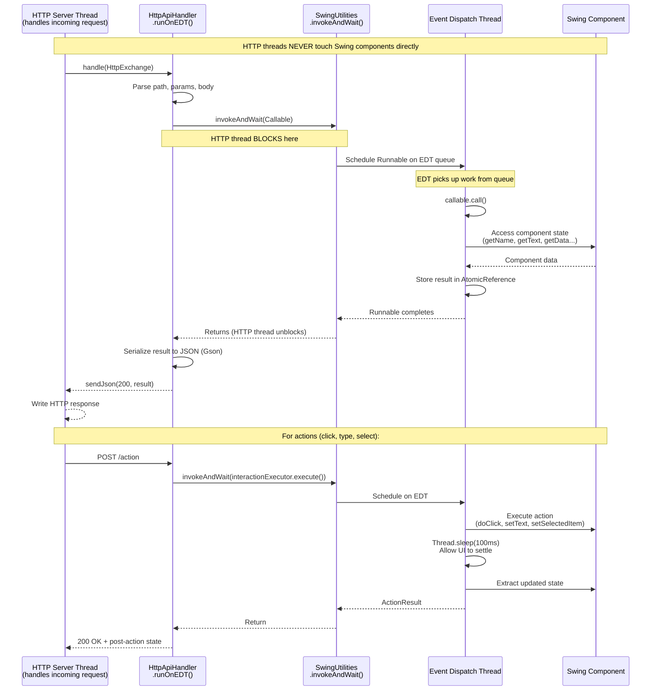
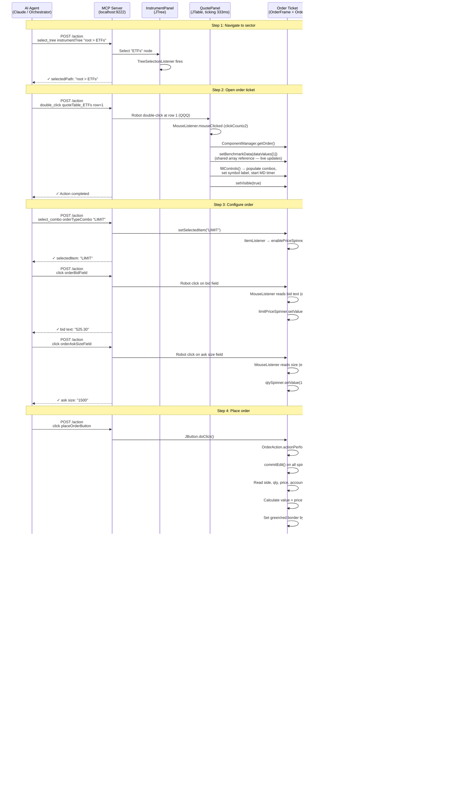

# SwingMCP Server Diagrams

## 1. How the MCP Server Works (Runtime Flow)

This diagram shows the runtime interaction between an external client (Python orchestrator or Claude Code), the embedded HTTP server, the EDT bridge, and the live Swing application.

```mermaid
sequenceDiagram
    participant Client as External Client<br/>(Orchestrator / Claude Code / curl)
    participant HTTP as HttpApiHandler<br/>(HTTP Server Thread)
    participant EDT as Event Dispatch Thread<br/>(Swing EDT)
    participant UI as Swing Application<br/>(Components)
    participant Robot as java.awt.Robot<br/>(Screen Capture & Input)

    Note over Client,Robot: === Startup ===
    UI->>UI: main() initializes Swing UI
    UI->>HTTP: SwingMcpServer.start(9222)
    HTTP->>HTTP: JDK HttpServer binds localhost:9222

    Note over Client,Robot: === GET /tree — Component Tree ===
    Client->>HTTP: GET /tree?interactable=true
    HTTP->>EDT: invokeAndWait(treeWalker.walk())
    EDT->>UI: Window.getWindows()
    EDT->>UI: Recursive traversal of all containers
    EDT->>UI: Assign stable IDs via putClientProperty()
    EDT-->>HTTP: List<ComponentNode> (flat array)
    HTTP->>HTTP: Gson serializes to JSON
    HTTP-->>Client: 200 OK — JSON array of components

    Note over Client,Robot: === GET /component/{name} — Component State ===
    Client->>HTTP: GET /component/blotterTable
    HTTP->>EDT: invokeAndWait(findComponent + extractState)
    EDT->>UI: Find by name or ID
    EDT->>UI: Extract type-specific state<br/>(columns, data, selectedRows for JTable)
    EDT-->>HTTP: Map<String, Object>
    HTTP-->>Client: 200 OK — JSON state object

    Note over Client,Robot: === POST /action — User Interaction ===
    Client->>HTTP: POST /action<br/>{"action":"click", "target":"placeOrderButton"}
    HTTP->>HTTP: Parse ActionRequest from JSON body
    HTTP->>EDT: invokeAndWait(interactionExecutor.execute())
    EDT->>UI: findComponent("placeOrderButton")

    alt Button click (doClick)
        EDT->>UI: JButton.doClick()
    else Coordinate-based click (Robot)
        EDT->>UI: Get component screen bounds
        EDT->>Robot: Robot.mouseMove(x, y)
        EDT->>Robot: Robot.mousePress() + mouseRelease()
    end

    EDT->>EDT: Thread.sleep(100ms) — settle delay
    EDT->>UI: Extract updated component state
    EDT-->>HTTP: ActionResult(success, componentState)
    HTTP-->>Client: 200 OK — JSON with post-action state

    Note over Client,Robot: === POST /action — Combo Selection ===
    Client->>HTTP: POST /action<br/>{"action":"select_combo",<br/>"target":"orderTypeCombo", "value":"LIMIT"}
    HTTP->>EDT: invokeAndWait(execute)
    EDT->>UI: findComponent("orderTypeCombo")
    EDT->>UI: JComboBox.setSelectedItem("LIMIT")
    EDT->>UI: ItemListener fires → enables limitPriceSpinner
    EDT->>EDT: 100ms settle
    EDT-->>HTTP: ActionResult with updated combo state
    HTTP-->>Client: 200 OK

    Note over Client,Robot: === POST /action — Table Double Click ===
    Client->>HTTP: POST /action<br/>{"action":"double_click",<br/>"target":"quoteTable_ETFs", "row":1}
    HTTP->>EDT: invokeAndWait(execute)
    EDT->>UI: findComponent("quoteTable_ETFs")
    EDT->>UI: Calculate cell center for row 1
    EDT->>Robot: Robot.mouseMove(cellX, cellY)
    EDT->>Robot: Robot.mousePress() x2 (double-click)
    EDT->>UI: MouseListener.mouseClicked fires<br/>→ Opens order ticket for QQQ
    EDT->>EDT: 100ms settle
    EDT-->>HTTP: ActionResult
    HTTP-->>Client: 200 OK

    Note over Client,Robot: === GET /screenshot — Screen Capture ===
    Client->>HTTP: GET /screenshot
    HTTP->>EDT: invokeAndWait(screenshotCapture.capture())
    EDT->>UI: Find main JFrame → getLocationOnScreen()
    EDT->>Robot: Robot.createScreenCapture(bounds)
    Robot-->>EDT: BufferedImage (PNG pixels)
    EDT->>EDT: ImageIO.write → byte[]
    EDT->>EDT: Base64.encode(pngBytes)
    EDT-->>HTTP: CaptureResult(base64, width, height)
    HTTP-->>Client: 200 OK — #123;"image":"data:image/png;base64,..."#125;

    Note over Client,Robot: === GET /contrast — Accessibility Check ===
    Client->>HTTP: GET /contrast
    HTTP->>EDT: invokeAndWait(contrastChecker.checkAll())
    EDT->>UI: Walk all text-bearing components
    EDT->>EDT: Calculate luminance ratio<br/>for each fg/bg color pair
    EDT-->>HTTP: {issues: [...], totalChecked, totalIssues}
    HTTP-->>Client: 200 OK — WCAG contrast report
```

## 2. How the Server is Designed (Architecture & Class Structure)

This diagram shows the internal class structure, responsibilities, and data flow within the swing-mcp-lib library and its integration with the demo app.

```mermaid
graph TB
    subgraph External["External Clients"]
        Orch["Python Orchestrator<br/><i>orchestrator.py</i><br/>Claude agent loop"]
        CLI["Claude Code / curl<br/>Direct HTTP calls"]
    end

    subgraph SwingApp["Java Swing Application Process (Single JVM)"]

        subgraph DemoApp["demo-app — Equity Trading Application"]
            TA["TradingApp<br/><i>main()</i><br/>Entry point, FlatLaf setup"]
            FB["FrameBuilder<br/>Main JFrame + JInternalFrames"]
            CM["ComponentManager<br/>Panel lifecycle, frame creation"]
            RM["ResourceManager<br/>Global singletons:<br/>JFrame, JDesktopPane,<br/>StatusBarPanel, OrderID"]
            LM["LayoutManager<br/>Save/restore positions<br/>~/.swingmcp/layout.properties"]
            MM["MenuManager<br/>File, View, Help menus"]
            PB["PanelBuilder<br/>Panel factory"]

            subgraph Panels["UI Panels"]
                IP["InstrumentPanel<br/>JTree portfolio navigator<br/>5 sectors, 27 symbols"]
                QP["QuotePanel<br/>Live market data JTable<br/>Ticks 333ms, 11 columns"]
                BP["BlotterPanel<br/>Order blotter JTable<br/>11 columns, color-coded"]
                SBP["StatusBarPanel<br/>Status + system info<br/>Updates every 1s"]
            end

            subgraph OrderTicket["Order Ticket"]
                OF["OrderFrame<br/>JInternalFrame layout<br/>Null layout, 600x595<br/>5 MD fields, spinners,<br/>combos, tabs, buttons"]
                O["Order<br/>Business logic<br/>Click handlers, ticking MD,<br/>blotter integration,<br/>order execution"]
            end

            RH["RequestHandler<br/>Async order processing<br/>2s simulated latency"]
            AL["AppLogger<br/>Logging + status bar"]
        end

        subgraph MCPLib["swing-mcp-lib — Embedded MCP Server Library"]
            SMS["SwingMcpServer<br/><i>start(port) / stop()</i><br/>JDK HttpServer lifecycle"]

            HAH["HttpApiHandler<br/>HTTP router + EDT bridge<br/><i>implements HttpHandler</i>"]

            subgraph Handlers["Request Handlers"]
                CTW["ComponentTreeWalker<br/>Recursive tree traversal<br/>Stable ID assignment<br/>Type/interactability filtering<br/>Flat array output (max 200)"]
                CSE["ComponentStateExtractor<br/>Per-type state extraction<br/>JTable: columns, data, rows<br/>JTree: nodes, paths<br/>JComboBox: items, selected<br/>JTextField: text, editable"]
                IE["InteractionExecutor<br/>Action execution engine<br/>click, double_click, type,<br/>select_combo, select_tree,<br/>menu, check/uncheck<br/>100ms settle delay"]
                SC["ScreenshotCapture<br/>Robot.createScreenCapture<br/>Full window or component<br/>PNG → Base64"]
                CC["ContrastChecker<br/>WCAG 2.1 validation<br/>Luminance calculation<br/>AA (4.5:1) / AAA (7:1)"]
                UAR["UserActionRecorder<br/>Global AWT event listener<br/>Records to markdown files"]
            end

            subgraph Models["Data Models"]
                CN["ComponentNode<br/>id, type, name, parent,<br/>bounds, visible, text"]
                AR["ActionRequest<br/>action, target, text,<br/>value, index, row, path"]
                ARs["ActionResult<br/>success, action, target,<br/>componentState, error"]
                TD["TableData<br/>columns, data, rowCount,<br/>dataRange, hasMore"]
            end
        end
    end

    %% External connections
    Orch -->|"HTTP :9222"| SMS
    CLI -->|"HTTP :9222"| SMS

    %% Server startup
    TA -->|"SwingMcpServer.start(9222)"| SMS
    SMS -->|"creates"| HAH

    %% App initialization
    TA --> FB
    TA --> CM
    TA --> PB
    TA --> LM
    FB --> RM
    FB --> SBP
    CM --> RM
    PB --> IP
    PB --> QP
    PB --> BP
    MM --> CM

    %% Order flow
    QP -->|"double-click row"| CM
    CM -->|"getOrder()"| O
    IP -->|"double-click leaf"| CM
    O --> OF
    O -->|"addToBlotter()"| BP
    O -->|"registerOrder()"| RH
    RH -->|"updateOrderStatus()"| BP
    RH -->|"executeOrder()"| O

    %% Handler routing
    HAH -->|"/tree"| CTW
    HAH -->|"/component/{name}"| CSE
    HAH -->|"/action"| IE
    HAH -->|"/screenshot"| SC
    HAH -->|"/contrast"| CC
    HAH -->|"/record/*"| UAR

    %% EDT bridge
    HAH -.->|"invokeAndWait()"| CTW
    HAH -.->|"invokeAndWait()"| CSE
    HAH -.->|"invokeAndWait()"| IE
    HAH -.->|"invokeAndWait()"| SC
    HAH -.->|"invokeAndWait()"| CC

    %% Handler → Component access
    CTW -->|"Window.getWindows()"| Panels
    CTW -->|"Window.getWindows()"| OrderTicket
    CSE -->|"extractState()"| Panels
    CSE -->|"extractState()"| OrderTicket
    IE -->|"findComponent()"| Panels
    IE -->|"findComponent()"| OrderTicket
    SC -->|"getLocationOnScreen()"| Panels

    %% Models usage
    CTW -->|"produces"| CN
    IE -->|"consumes"| AR
    IE -->|"produces"| ARs
    CSE -->|"produces"| TD

    %% Styling
    classDef external fill:#4a6fa5,stroke:#2d4a7a,color:#fff
    classDef server fill:#2d6a4f,stroke:#1b4332,color:#fff
    classDef handler fill:#40916c,stroke:#2d6a4f,color:#fff
    classDef model fill:#52796f,stroke:#354f52,color:#fff
    classDef panel fill:#6d597a,stroke:#4a3a5c,color:#fff
    classDef order fill:#b56576,stroke:#8a3a4f,color:#fff
    classDef app fill:#e07a5f,stroke:#b85842,color:#fff
    classDef manager fill:#d4a373,stroke:#b08050,color:#000

    class Orch,CLI external
    class SMS,HAH server
    class CTW,CSE,IE,SC,CC,UAR handler
    class CN,AR,ARs,TD model
    class IP,QP,BP,SBP panel
    class OF,O order
    class TA app
    class FB,CM,RM,LM,MM,PB,RH,AL manager
```



## 3. EDT Bridge Pattern (Thread Safety Detail)

This diagram zooms in on the critical EDT bridge pattern that ensures all Swing component access is thread-safe.



## 4. Data Flow: Order Placement via MCP

This diagram shows the complete data flow when an AI agent places an order through the MCP server.


